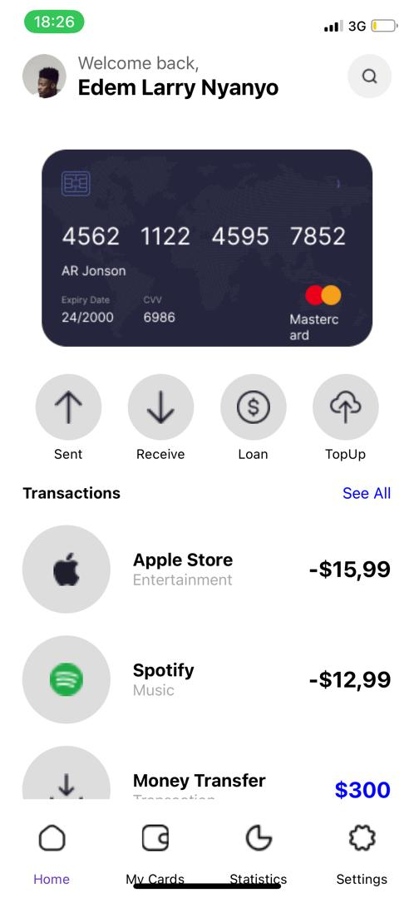
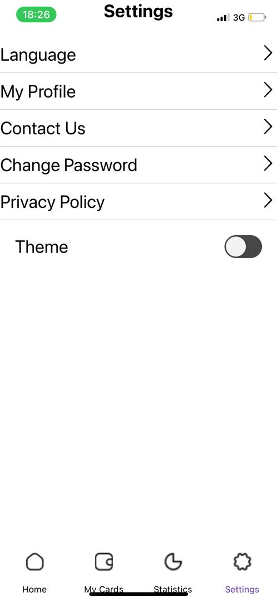
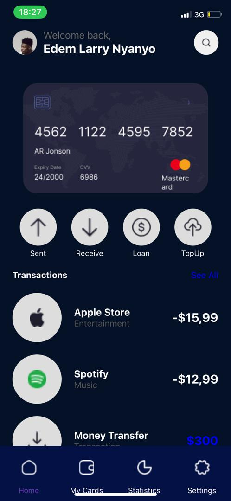
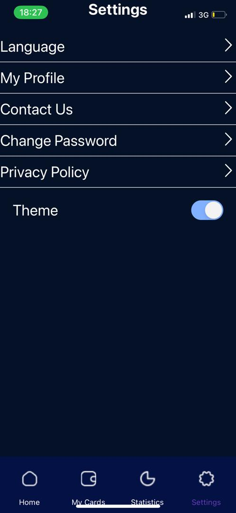

# React Native Finance App

This is a React Native Finance App that provides users with a seamless experience for managing their finances. The app includes features such as viewing credit card information, recent transactions, and switching between different sections like Home, My Cards, Statistics, and Settings.

## Features

- **Home Screen**: Displays the user's profile, a credit card image, transaction icons (Send, Receive, Loan, TopUp), and recent transactions.
- **Custom Bottom Navigation**: A tab bar with custom icons and labels, which changes its appearance based on the selected theme (light or dark).
- **Dynamic Theming**: Supports light and dark themes, changing the app's appearance accordingly.

## Screens

### Home Screen Light



### Settings Screen Light



### Home Screen Dark



### Settings Screen Dark



## Installation

1. Clone the repository:
   ```bash
   git clone https://github.com/Edemowns/rn-assignment5-11052329.git